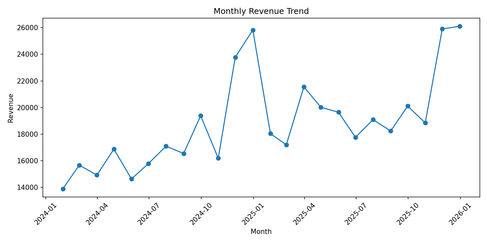
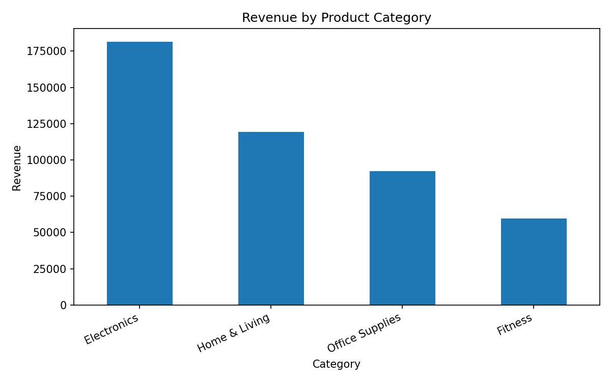
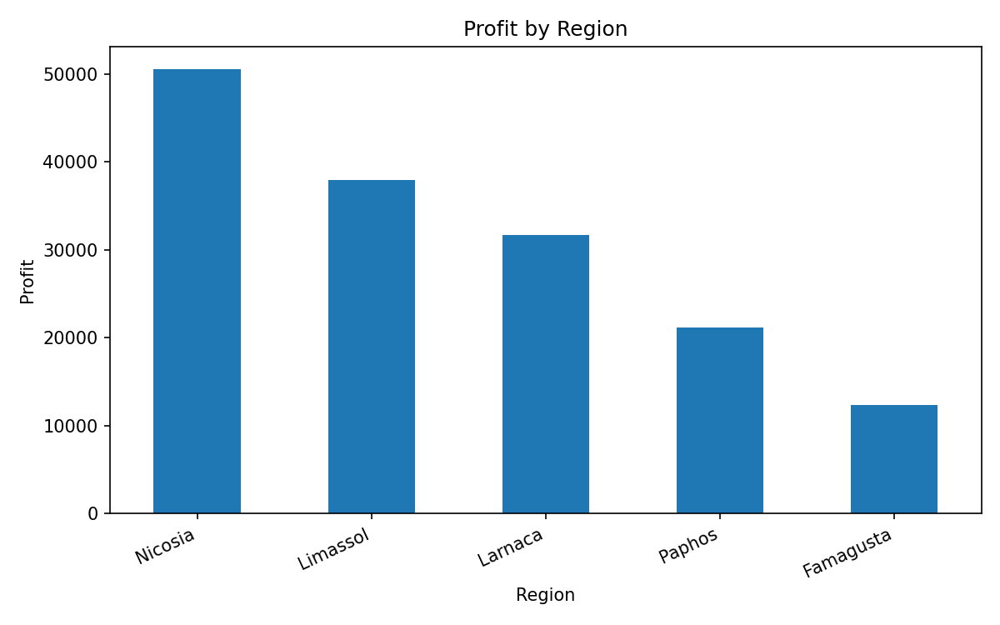

# SME Sales Analytics & Revenue Forecasting

## Project Overview

This project analyzes sales data for a small-to-medium retail business and turns raw transaction records into business insights, KPI reports, customer segmentation, and revenue forecasting.

The project is designed as a professional data science portfolio project for business analytics, showing how Python can support better decisions for small businesses.

## Business Problem

Small businesses often have transaction data but no clear answer to questions such as:

- Which products generate the most revenue and profit?
- Which regions and sales channels perform best?
- How does revenue change over time?
- Which customer segments are most valuable?
- What revenue can the business expect next month?
- Where should the business focus marketing and inventory decisions?

This project answers those questions using Python-based analysis.

## Dataset

The dataset is synthetic but realistic. It contains two years of transaction-level sales records for a retail SME.

Main columns:

- `invoice_id`
- `order_date`
- `customer_id`
- `customer_segment`
- `region`
- `sales_channel`
- `category`
- `product`
- `quantity`
- `unit_price`
- `discount`
- `revenue`
- `profit`

The data is stored in:

```text
data/sme_sales_data.csv
```

## Project Workflow

1. Load and inspect transaction data
2. Clean and prepare date, revenue, and profit fields
3. Calculate business KPIs
4. Analyze product, region, channel, and customer performance
5. Build customer segmentation using RFM analysis
6. Forecast monthly revenue
7. Generate business recommendations
8. Present results in a dashboard

## Key Business Metrics

The project calculates:

- Total revenue
- Total profit
- Number of orders
- Average order value
- Revenue by category
- Profit by region
- Revenue by sales channel
- Monthly revenue trend
- Customer value segments

## Methods Used

- Exploratory Data Analysis
- KPI reporting
- Group-by aggregation
- Time-series revenue trend analysis
- RFM customer segmentation
- Simple revenue forecasting
- Dashboard design

## Tools and Libraries

- Python
- Pandas
- NumPy
- Matplotlib
- Plotly
- Scikit-learn
- Streamlit
- Jupyter Notebook

## Repository Structure

```text
sme-sales-analytics-forecasting/
│
├── data/
│   └── sme_sales_data.csv
│
├── notebooks/
│   └── 01_business_sales_analysis.ipynb
│
├── src/
│   ├── make_dataset.py
│   ├── business_kpis.py
│   ├── rfm_segmentation.py
│   └── revenue_forecast.py
│
├── dashboard/
│   └── app.py
│
├── reports/
│   ├── monthly_kpis.csv
│   ├── category_performance.csv
│   ├── region_performance.csv
│   └── figures/
│
├── requirements.txt
├── .gitignore
└── README.md
```

## Example Outputs

### Monthly Revenue Trend



### Revenue by Product Category



### Profit by Region



## How to Run the Project

### 1. Clone the repository

```bash
git clone https://github.com/MasBen71/sme-sales-analytics-forecasting.git
cd sme-sales-analytics-forecasting
```

### 2. Create and activate a virtual environment

```bash
python -m venv venv
venv\Scripts\activate
```

On macOS/Linux:

```bash
source venv/bin/activate
```

### 3. Install dependencies

```bash
pip install -r requirements.txt
```

### 4. Run the analysis scripts

```bash
python src/business_kpis.py
python src/rfm_segmentation.py
python src/revenue_forecast.py
```

### 5. Run the Streamlit dashboard

```bash
streamlit run dashboard/app.py
```

## Business Recommendations

Based on the analysis, the business can:

- Prioritize high-profit categories instead of only high-revenue categories
- Focus marketing on the strongest customer segments
- Track monthly revenue trend to prepare inventory and staffing
- Compare performance across regions and channels
- Use customer segmentation to create targeted offers
- Monitor discount levels to protect profit margins

## Why This Project Matters

This project demonstrates an end-to-end business analytics workflow:

- Raw data to clean dataset
- Dataset to KPIs
- KPIs to visual insight
- Insight to business recommendations
- Analysis to interactive dashboard

It is suitable for showing practical data science skills to employers, freelance clients, and small-business owners.

## Author

Masoud Elahian  
Data Scientist | Physics PhD Researcher  
GitHub: [MasBen71](https://github.com/MasBen71)
